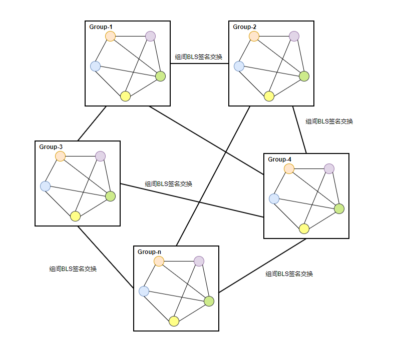

## 摘要
分组验签共识方案在现有 Giskard 共识基础上，将验证节点集合随机分组，每个分组中的节点只需要在组内达成消息共识并生成该消息的 BLS 聚合签名，各分组再进行组间签名交换，将所有分组的签名重新聚合成完整的签名结果，从而实现该消息在整个网络的最终一致性。
该方案提升了现有 Giskard 共识的可扩展性，降低了网络通信复杂度、消息复杂度，一定程度上提升了共识效率以及整个区块链的交易处理性能。

## 目的

缩小共识范围，不需要每个验证节点都处理网络中所有的共识消息，只聚焦本组节点的消息签名，以此降低整个网络的通信复杂度。同时，分组“并行”共识加速了共识速度，而随机分组可以尽可能的减小恶意节点联合控制分组共识，最大限度地降低整个分组作弊的可能性。

## 分组节点网络拓扑结构图



## 随机分组说明

### 分组原则

- 分组人数的设定通过参数治理流程修改
- 分组人数的设定不能少于4名，且不超过25名
- 最后一个组的人数<=每组人数的一半时，取消该组，将该组人数分配到其他组（G1 -> G2 -> G3 -> G4 -> ...依次分配）

### 分组算法

在每个共识轮的选举区块，选举出下一个共识轮的验证人集合，同时根据分组原则，将所有验证人洗牌分组。
分组算法需要具有不可预测、抗碰撞性和**可验证**等特性。

### 基于VRF随机数或者选举区块时间戳分组

1. 以选举区块的VRF随机数或者选举区块时间戳做为随机算法的种子，对验证人集合进行随机排序
2. 根据分组原则，将随机排序的集合进行切割分组

### 基于节点距离分组

1. 将所有验证节点分别与 index-0 的节点计算节点距离（基于 nodeID，通过异或的二进制运算得到，参考`节点发现`模块`logdist`函数），根据节点距离由小到大排序，如果距离相同，index越小排越前（index-0肯定是排在最前面）
2. 根据分组原则，将重新排序的集合进行切割分组

## 分组共识说明

分组共识主要涉及对区块投票（PrepareVote）和视图切换（ViewChange）这两类消息的处理

- 针对两种消息本身的发送和转发规则的修改
- 针对两种消息衍生出的分组聚合签名消息 RGBlockQuorumCert、RGViewChangeQuorumCert 的处理

### 广播规则

上述消息，使用 `gossip` 协议传播：

- `Gossip` 协议是可扩展的，只需要 `O(logN(base k))` 个周期就能把消息传递给所有节点。某个节点在往固定数量节点传播消息过程中，并不需要等待确认（ack），并且，即使某条消息传播过程中丢失，它也不需要做任何补偿措施。例如：某个节点本来需要将消息传播给 4 个节点，但是由于网络或者其他原因，只有 3 个消息接收到消息，即使这样，这对最终所有节点接收到消息是没有任何影响的。
  
- 假定 `fanout=4` ，在节点数分别为：`20/40/80/160/320` 时，消息传播需要的周期数

| 节点数 | 20   | 40   | 80   | 160  | 320  |
| :----- | :--- | :--- | :--- | :--- | :--- |
| 周期数 | 2.16 | 2.66 | 3.16 | 3.44 | 4.16 |

> 从表中得知，当节点数成倍增加时，周期循环次数并没有增加很多，即：Gossip 具备很好的可扩展性。

### 消息类型-转发规则

( 注：`“部分”的定义：假设节点总数为n，部分节点即为Sqrt(n)；k = fanout` )

| 消息类型                  | 消息说明                                                  | 发送规则                                         | 转发规则                                                     | 说明                       | 备注                                     |
| :------------------------ | :-------------------------------------------------------- | :----------------------------------------------- | :----------------------------------------------------------- | -------------------------- | ---------------------------------------- |
| PrepareBlock              | 提议区块消息                                              | 所有共识节点 + k 个非共识节点                    | 所有共识节点 + k 个非共识节点（去除已接收该msgHash的节点）   | 全网所有节点都需要接收     | 和现有处理保持一致                       |
| PrepareVote               | 区块的投票签名消息                                        | 所有本组节点 + 部分非本组节点+ k 个非共识节点    | 所有G组节点 + 部分非G组节点 + k 个非共识节点（去除已接收该msgHash的节点） | 本分组内所有节点都需要接收 | 消息不扩散到所有节点，聚焦在本组节点     |
| RGBlockQuorumCert         | 分组内对区块的聚合签名消息                                | 部分本组节点 + 所有的非本组节点 + 部分非共识节点 | 部分G组节点 + 所有非G组节点 + k 个非共识节点（去除已接收该msgHash的节点） | 全网所有节点都需要接收     | 新增消息类型，消息尽可能扩散到非本组节点 |
| GetRGBlockQuorumCert      | 获取缺失的区块分组聚合签名                                | 部分共识节点 + k 个非共识节点                    | 不转发                                                       | 同步请求消息               | 新增消息类型                             |
| RGBlockQuorumCerts        | 区块的分组聚合签名，对GetRGBlockQuorumCert请求的响应      | 定向发送                                         | 不转发                                                       | 同步响应消息               | 新增消息类型                             |
| GetPrepareVote            | 获取缺失的区块节点签名                                    | 部分共识节点 + k 个非共识节点                    | 不转发                                                       | 同步请求消息               | 和现有处理保持一致                       |
| PrepareVotes              | 区块的节点签名，对GetPrepareVote请求的响应                | 定向发送                                         | 不转发                                                       | 同步响应消息               | 和现有处理保持一致                       |
| ViewChange                | 视图切换的签名消息                                        | 所有本组节点 + 部分非本组节点+ k 个非共识节点    | 所有G组节点 + 部分非G组节点 + k 个非共识节点（去除已接收该msgHash的节点） | 本分组内所有节点都需要接收 | 消息不扩散到所有节点，聚焦在本组节点     |
| RGViewChangeQuorumCert    | 分组内对视图切换的聚合签名消息                            | 部分本组节点 + 所有的非本组节点 + 部分非共识节点 | 部分G组节点 + 所有非G组节点 + k 个非共识节点（去除已接收该msgHash的节点） | 全网所有节点都需要接收     | 新增消息类型，消息尽可能扩散到非本组节点 |
| GetRGViewChangeQuorumCert | 获取缺失的视图分组聚合签名                                | 部分共识节点 + k 个非共识节点                    | 不转发                                                       | 同步请求消息               | 新增消息类型                             |
| RGViewChangeQuorumCerts   | 视图的分组聚合签名，对GetRGViewChangeQuorumCert请求的响应 | 定向发送                                         | 不转发                                                       | 同步响应消息               | 新增消息类型                             |
| GetViewChange             | 获取缺失的视图节点签名                                    | 部分共识节点 + k 个非共识节点                    | 不转发                                                       | 同步请求消息               | 和现有处理保持一致                       |
| ViewChanges               | 视图的节点签名，对GetViewChange请求的响应                 | 定向发送                                         | 不转发                                                       | 同步响应消息               | 和现有处理保持一致                       |

### 组间聚合签名交换

( 注：`"合并聚合签名"的定义：qc1、qc2的签名者信息均不同，则直接合并qc1、qc2；qc1的签名者数>qc2的签名者数，保留qc1` )

#### 共识流程

1. PrepareBlock 阶段

   提议人：PrepareBlock消息发送给所有连接的共识节点和部分非共识节点

   验证人：接收消息后转发给所有连接的共识节点和部分非共识节点

   非共识节点：接收消息后转发给所有连接的共识节点和部分非共识节点

2. PrepareVote 阶段

   投票人（G1）：PrepareVote消息发送给所有连接的本组节点、部分非本组节点、部分非共识节点

   验证人（G1）：处理保存，并转发给所有连接的本组节点、部分非本组节点、部分非共识节点

   验证人（G2）：处理保存，并转发给所有连接的G1组节点、部分非本组节点、部分非共识节点

   非共识节点：接收消息后转发给所有连接的G1组节点、部分非本组节点、部分非共识节点

3. RGBlockQuorumCert 阶段

   分组内任意节点收齐 **n-f** 个签名后，生成分组聚合签名 RGBlockQuorumCert

   发送人（G1）：RGBlockQuorumCert 消息发送给所有连接的部分本组节点、所有的非本组节点、部分非共识节点

   验证人（G1）：“合并”该分组聚合签名，转发给所有连接的部分本组节点、所有的非本组节点、部分非共识节点

   验证人（G2）：“合并”该分组聚合签名，转发给所有连接的部分G1组节点、所有的非本组节点、部分非共识节点

   非共识节点：“合并”该分组聚合签名，发给所有连接的部分G1组节点、所有的非本组节点、部分非共识节点

#### 同步流程

1. GetRGBlockQuorumCert 阶段

   每隔1秒，向所有连接的部分共识节点和非共识节点请求缺失的区块分组聚合签名；

   被同步节点有该分组聚合签名则响应 RGBlockQuorumCerts 消息，否则不发送；

   说明：针对某个区块，GetRGBlockQuorumCert 同步请求只发送一次，如果“超时”该区块仍未qc，则进入GetPrepareVote 阶段;

2. GetPrepareVote 阶段

   前提：针对某个区块如果发送过 GetRGBlockQuorumCert 且时间超过2*rtt时间，则进入 GetPrepareVote 阶段;

   每隔1秒，向所有连接的部分共识节点和非共识节点请求缺失的节点签名；

   被同步节点有该节点签名则响应 PrepareVotes 消息，否则不发送；
   

**针对视图的组间签名交换流程和区块的处理类似，此处不再赘述**

## 主要修改点

### 预连接逻辑

选举区块被确认后，发送`AddValidatorEvent`通知，p2p模块接收到通知后根据分组信息，预先连接本组节点。

### CBFT ValidatorPool增加分组

```
type GroupID uint32

type GroupNode struct {
	Index     uint32             `json:"index"`
	NodeID    discover.NodeID    `json:"nodeID"`	// 便于peer发送消息
}

type GroupNodes []GroupNode

type GroupMap map[GroupID]GroupNodes

type Validators struct {
	Nodes            ValidateNodeMap `json:"validateNodes"`
	ValidBlockNumber uint64          `json:"validateBlockNumber"`
	sortedNodes SortedValidatorNode
	groups GroupMap
}

func group();	// 分组逻辑函数
```

### `Gossip` 协议广播策略

增加分组消息的广播逻辑；
修改 PrepareVote、ViewChange 等消息的广播/转发策略；
增加 RGBlockQuorumCert、RGViewChangeQuorumCerts 等消息的广播/转发策略；