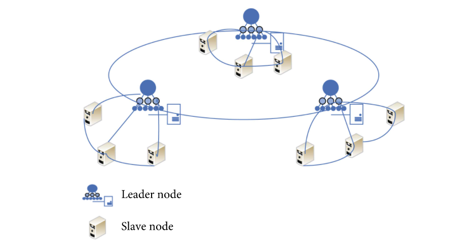

## 摘要
分组共识方案在现有 Giskard 共识基础上，将验证节点集合随机分组，每个分组中的节点只需要在组内达成消息共识并生成该消息的 BLS 聚合签名，各分组再进行组间签名交换，将所有分组的签名重新聚合成完整的签名结果，从而实现该消息在整个网络的最终一致性。
该方案可提升现有 Giskard 共识的可扩展性，降低网络通信复杂度、消息复杂度，但会牺牲系统整体性能，共识效率以及整个区块链的交易处理性能会有所下降。

## 目的

缩小共识范围，不需要每个验证节点都处理网络中所有的共识消息，只聚焦本组节点的消息签名，以此降低整个网络的通信复杂度和消息数量。同时，随机分组可以尽可能的减小恶意节点联合控制分组共识，最大限度地降低整个分组作弊的可能性。

## 分组节点的角色划分

在 Giskard 1.0 中，为了尽快达成消息共识，每个节点产生的消息（prepareBlock、prepareVote、viewChange等）都尽可能的发送并转发给所有共识节点，传输开销在具有 n 个节点的网络中达到了 O（n2）。因此，当节点超过一定数量时，协议的性能会急剧下降，且节点的网络流量也会大幅增加。倘若这些消息不发送给所有节点，而是通过`gossip` 协议在整个网络中传播，消息的传播周期和消息总量依旧不可控。

为了支撑更多的共识节点数，设计了分组共识方案。验证节点通过分组机制分组后，被分成两种角色：

- 普通节点（Slave node）：只关注本组内共识，这类节点只会将共识消息在本组内发送和转发，不对外（其他分组）发送和转发共识消息（分组聚合签名消息）
- 协调节点（Leader node）：对本分组进行统一控制，这类节点不仅需要将共识消息在本组内发送和转发，还需要和其他分组的节点通信（主要用于组间BLS聚合签名交换）

协调节点对整个系统共识至关重要，考虑到网络的不确定性以及节点作恶的可能性，每个分组至少需要不少于分组节点总数1/5的协调节点，比如某个分组有25个节点，那么该分组一般设置为20个普通节点和5个协调节点

同时考虑到协调节点不作为的判断依据难以确认并且重选机制复杂，这些逻辑势必会给系统带来额外开销，因此分组内的每一个节点在这两种角色上的划分并非固定，普通节点在监测到本组内的协调节点不作为时，可自动升级为协调节点并对外通信，但这也可能会造成更多的消息数量。

## 随机分组说明

### 分组原则

- 分组人数的设定通过参数治理流程修改
- 分组人数的设定不能少于4名，且不超过25名
- 最后一个组的人数<=每组人数的一半时，取消该组，将该组人数分配到其他组（G1 -> G2 -> G3 -> G4 -> ...依次分配）

### 分组算法

在每个共识轮的选举区块，选举出下一个共识轮的验证人集合，同时根据分组原则，将所有验证人洗牌分组。
分组算法需要具有不可预测、抗碰撞性和**可验证**等特性。

### 基于VRF随机数或者选举区块时间戳分组

1. 以选举区块的VRF随机数或者选举区块时间戳做为随机算法的种子，对验证人集合进行随机排序
2. 根据分组原则，将随机排序的集合进行切割分组
3. 各分组排位第一的节点即为该组协调节点

### 基于节点距离分组

1. 将所有验证节点分别与 index-0 的节点计算节点距离（基于 nodeID，通过异或的二进制运算得到，参考`节点发现`模块`logdist`函数），根据节点距离由小到大排序，如果距离相同，index越小排越前（index-0肯定是排在最前面）
2. 根据分组原则，将重新排序的集合进行切割分组
3. 各分组排位第一的节点即为该组协调节点

## 分组共识说明

分组共识主要涉及对区块投票（PrepareVote）和视图切换（ViewChange）这两类消息的处理

- 针对两种消息本身的发送和转发规则的修改
- 针对两种消息衍生出的分组聚合签名消息 RGBlockQuorumCert、RGViewChangeQuorumCert 的处理

### 连接机制

请参看 [分组共识下的P2P方案](https://github.com/PlatONnetwork/PIPs/blob/master/PIPs/PIP-3.md)

### 广播规则

上述消息，使用 `gossip` 协议传播：

- `Gossip` 协议是可扩展的，只需要 `O(logN(base k))` 个周期就能把消息传递给所有节点。某个节点在往固定数量节点传播消息过程中，并不需要等待确认（ack），并且，即使某条消息传播过程中丢失，它也不需要做任何补偿措施。例如：某个节点本来需要将消息传播给 4 个节点，但是由于网络或者其他原因，只有 3 个消息接收到消息，即使这样，这对最终所有节点接收到消息是没有任何影响的。
  
- 假定 `fanout=4` ，在节点数分别为：`20/40/80/160/320` 时，消息传播需要的周期数

| 节点数 | 20   | 40   | 80   | 160  | 320  |
| :----- | :--- | :--- | :--- | :--- | :--- |
| 周期数 | 2.16 | 2.66 | 3.16 | 3.44 | 4.16 |

> 从表中得知，当节点数成倍增加时，周期循环次数并没有增加很多，即：Gossip 具备很好的可扩展性。

### 消息类型-转发规则

( 注：`“部分”的定义：假设分组节点总数为n，部分节点即为Sqrt(n)；k = fanout` )

| 消息类型               | 消息说明                       | 发送规则                                                     | 转发规则                                                     | 说明                       | 备注                                 |
| :--------------------- | :----------------------------- | :----------------------------------------------------------- | :----------------------------------------------------------- | -------------------------- | ------------------------------------ |
| PrepareBlock           | 提议区块消息                   | 所有共识节点 + k 个非共识节点                                | 所有共识节点 + k 个非共识节点（去除已接收该msgHash的节点）   | 全网所有节点都需要接收     | 和现有处理保持一致                   |
| PrepareVote            | 区块的投票签名消息             | 本组所有节点                                                 | 普通节点：转发给本组所有节点 协调节点：转发给本组所有节点 | 本分组内所有节点都需要接收 | 消息只在本组内进行扩散               |
| RGBlockQuorumCert      | 分组内对区块投票的聚合签名消息 | 协调节点：已连接的所有共识节点 + k 个非共识节点 普通节点：等待coordinatorWaitTimeout时间自动升级为协调节点 | 普通节点：转发给已连接的所有共识节点 + k 个非共识节点 协调节点：转发给已连接的所有共识节点 + k 个非共识节点 非共识节点：转发给已连接的所有共识节点 + k 个非共识节点 | 全网所有节点都需要接收     | 新增消息类型，消息尽可能扩散所有节点 |
| BlockQuorumCert        | 对区块投票的完整聚合签名消息   | 发送给所有连接的节点                                         | BlockQuorumCert 归类为同步消息，该消息不做转发               | 全网所有节点都需要接收     | 消息尽可能扩散所有节点               |
| ViewChange             | 视图切换的签名消息             | 本组所有节点                                                 | 普通节点：转发给本组所有节点 协调节点：转发给本组所有节点 | 本分组内所有节点都需要接收 | 消息只在本组内进行扩散               |
| RGViewChangeQuorumCert | 分组内对视图切换的聚合签名消息 | 协调节点：已连接的所有共识节点 + k 个非共识节点 普通节点：等待coordinatorWaitTimeout时间自动升级为协调节点 | 普通节点：转发给已连接的所有共识节点 + k 个非共识节点 协调节点：转发给已连接的所有共识节点 + k 个非共识节点 非共识节点：转发给已连接的所有共识节点 + k 个非共识节点 | 全网所有节点都需要接收     | 新增消息类型，消息尽可能扩散所有节点 |
| ViewChangeQuorumCert   | 对视图切换的完整聚合签名信息   | 发送给所有连接的节点                                         | ViewChangeQuorumCert 归类为同步消息，该消息不做转发          | 全网所有节点都需要接收     | 消息尽可能扩散所有节点               |                                                    | 同步响应消息               | 和现有处理保持一致                                           |

## 消息复杂度分析

CBFT 在具有 n 个节点的网络中的传输开销为O（n²），也就是说每个节点产生的消息都需要广播给所有共识节点。

以 PrepareVote 阶段共识为例，分析分组前后的消息复杂度：假设共识节点总数为 n，平均分成 x 组，每组成员数为 n/x。

分组前，PrepareVote 消息总量为 n²。

分组后，第一步，PrepareVote 消息只在分组内扩散，所以消息总量为 (n/x)² * x；第二步，RGBlockQuorumCert 消息只由每组的协调节点产生并发送，以分组人数上限25为例，每组的初始协调节点数为5个，假设这5个协调节点产生的分组聚合签名各不相同，在不考虑普通节点升级为协调节点的情况下，RGBlockQuorumCert 消息总量为 5x * n。

| 阶段   | PrepareVote | RGBlockQuorumCert | 总计       |
| ------ | ----------- | ----------------- | ---------- |
| 分组前 | n²          |                   | n²         |
| 分组后 | (n/x)² * x  | 5x * n            | n²/x + 5xn |

举例，200个节点分成8组，每组25个节点，在区块投票阶段，分组前后整个网络的消息总量分别为40000和13000。可见分组共识能够大幅降低共识的消息复杂度，但分组增加了 RGBlockQuorumCert 阶段，同时分组间签名交换逻辑也较为复杂，所以共识效率会有所下降。

## 容错性对比

假设验证节点总数为N，可以平均分成X组，每组成员数为 N/X。分组之前，整个网络容错为 (N-1) / 3，分组之后，每组容错为 (N/X - 1) / 3，整个网络的容错为 (N-X) / 3，因为 X 大于1，所以分组后，整个网络的容错性会有所下降但差值不大。举例，200个节点分成8组，每组25个节点，分组前后整个网络的容错数分别为66和64

## 各项指标数据的采集

需要通过大量不同场景的测试，采集以下指标数据

### 共识效率指标
1. view出块率
2. view缺失数
3. view的平均时长
4. 平均出块速率（块/秒）

### 网络指标
1. 节点连接数
2. 通信复杂度
3. 一轮共识的消息总量（metrics统计）
4. 网络出入流量

### 性能指标
1. TPS
2. 交易延迟TTF

### 扩展性指标
1. 共识节点的增加对其余指标数据的影响

### 可靠性指标
1. 安全性证明
2. 活跃性证明