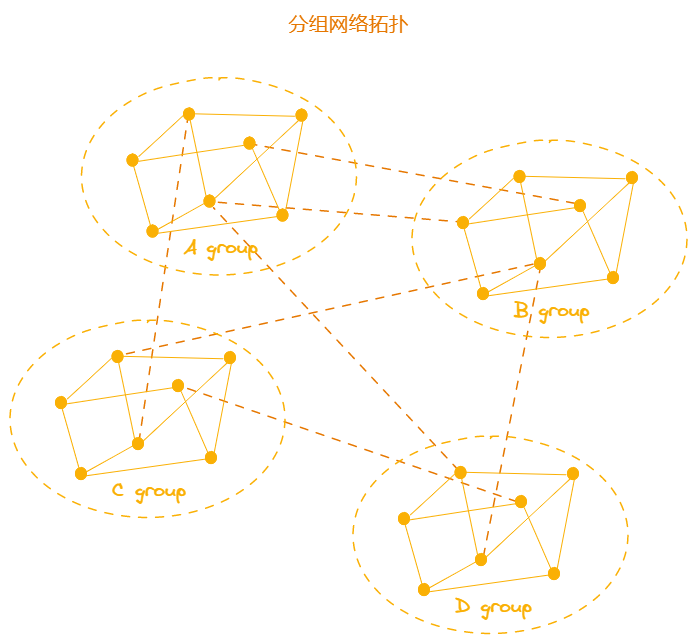
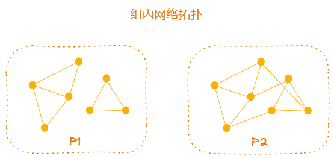
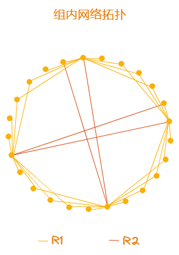
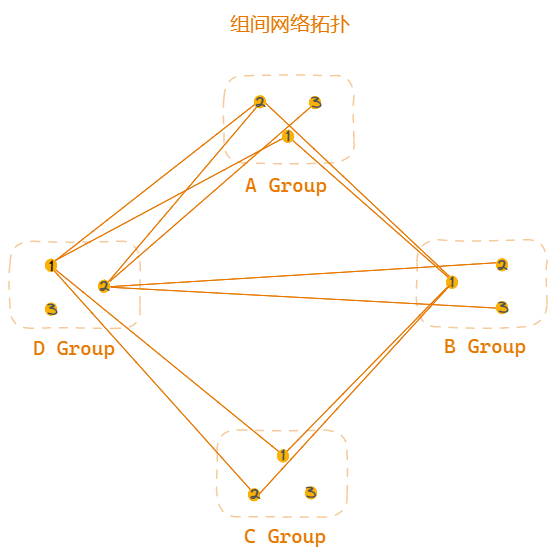

## 背景

基于扩容的驱动下，引入了新的共识机制“分组共识”，将所有共识节点划分成多个组，组内交互后再组间达成共识。由于扩容后共识节点的数量庞大，原先所有共识节点全部直连的方式已不再适用，因为本身资源有限并且消息量的激增，引起资源消耗过大，效率低下，因此需要一个新的互连方案做支撑。

## P2P网络

P2P（Peer-to-Peer）网络是一个分布式点对点网络，网络中的结点是对等的，既是资源提供者也是资源检索者，属于建立在公共互联网之上的覆盖层网络（overlay network）。

可以将整个网络视为一个图， G = (V, E)，其中 V 称为对等结点的集合，E 称为对等结点间连接的边的集合，网络中的所有对等连接形成一个图，理想情况下，只存在一个连通分量，即每个结点都存在可达路径，具备连通性，消息最终能到达目的地。

因此连接机制需要构建好覆盖层网络，维护好各结点间的邻接关系，保持整个网络的连通性。

## 基本目标

- 每个分组间及分组内快速形成一个连通图：保证共识消息传播的效率
- 各节点间的通信不造成消息泛滥、增大网络压力和降低传播效率
- 分组中的角色，在共识过程中的变更不影响连接的结构
- 切换共识轮时，新共识节点正常加入网络拓扑结构
- 共识节点的网络拓扑支持共识节点数的动态伸缩
- 少量连接的异常，不影响整体共识的进程

## 分组网络拓扑结构

首先将网络中的节点划分为共识节点和普通节点，共识节点负责区块的生产和验证，因此优先保证共识节点间形成一个高效的网络拓扑结构。所有共识节点经过分组后，相当于拆分成多个小网络，为保证各组内成员（GM）间快速通信，并且同其它组达成共识，各节点建立连接的原则为：

- 优先挑选本组内部分节点建立连接，组内形成一个连通图
- 在所有分组中挑选部分分组，对其分组内的部分节点建立连接，各组形成一个连通图
- 共识节点再保留一定连接数的资格，供普通节点建立连接，最终整个网络形成一个完整的大的连通图



根据分组共识的规则，组内通信达成一致是首要保证，其次是组间。显然在如此庞大的共识节点群中，直连所有节点是不可取的，因此需要一种规则去组织节点间的邻接关系。

那么该问题可进行拆分细化，分成两步，做两级保证：

- 组内保证

  组内节点间连通，并且在异常情况下，部分连接失效的情况下节点任然存在可达路径。通信消息在组间能迅速传播，由此保证组内消息传播的可靠性。

- 组间保证

  组间的保证由组内所有成员共同维护，整个组内至少一个成员与其它组连接了，那么消息就能传播出去，同理消息也能传播至组内，因此组间连通的要求就变得简单了，只需一条消息传入组内即可，由"组内保证"可知消息传播的可靠性，能传至各成员。

由此可见，组内通信成为关键问题，节点的连接数需要在可靠和效率中达到平衡。并且需要预留部分连接数用做预建连接（后文详解），因此实际可用的连接数是非常有限的。

### 组内网络拓扑结构

在构建网络类型时，可分为不规则网络和规则网络，首先对不规则网络的情况下进行分析。



上图为两种不同连接数量的连接图，分别使用随机算法连接的不规则网络拓扑结构：

###### P1

连接数的计算：f = (GM - 1) / 3，每个节点向组内的其它f个节点建立连接，有可能出现`P1`图所示的两个连通分量，组内未能形成一个连通图，通信受阻，消息无法传至全部成员。

###### P2

连接数的计算：h = floor(GM / 2)，每个节点向组内的其它h个节点建立连接，能在连接上保持重叠，最终形成一个连通图，保证节点间连通的同时，能快速传播至其它成员。

###### 结论

在利用随机算法建立连接时，形成的网络结构不可控，存在一定风险并且无法达到设计目标。把节点对外的连接称为"度"，（1）当度较少时可能存在被孤立的情况，（2）而度较多时，提高了连通的可靠性，但整体的消息量庞大并且占用过多的可用连接。

#### 组内连接算法



组内连接将构造一个规则的网络拓扑结构，在连接数的限制和消息量的限制下，保证各节点间连通性的健壮和传播效率，各节点的组内连接数将维持在一个较低的量下，并且分为`R1`和`R2`两个规则共同构建网络拓扑结构。

预先将组内所有成员按照某种规则排列，可视作“环”，整个规则将以邻居的概念组织各节点间的关系。

```
t=4, opp=h
```

###### R1

首先，每个节点向自身左右两边的邻居各连接 `t` 个节点，优先让整组连通。

###### R2

在`R1`基础上，每个节点再向自身左边第`h`个节点发起连接（也就是正对面），最终形成如上拓扑结构。节点在组内的连接量为 10 = t * 2 + 2 个，保持整组连通的同时，消息也能快速传播至全部成员，并且维持在此连接量上能保证只要消息传入组内任何成员就能传播至组内全部成员。

###### 结论

节点在充分连接自身邻居节点后，再向远距离的节点建立一个连接，同理远距离的某个节点也会连向自身，最终节点在组内连接为`10`个。连向远距离节点的目的是提高连接的范围，扩大自身的邻居圈提高传播效率（以消息发出一次为一个周期，最优能在两个周期传至全部成员），也提高连接的可靠性，避免在较少连接的情况下，节点间的部分连接异常导致节点被孤立（如图2）。

### 组间网络拓扑结构

组间关系的组织同样可视作“环”，以邻居的概念维护组间的连接关系，组间的关系实际由组内的每个成员共同构成。



```
lg（连接的组数）= 2
ln（外组内连接数）= 2
```

###### 外组的选择

设，oga（外组数）=3，节点自身在组内的下标=index，oneGroup=index%oga，twoGroup=oneGroup+ceil(oga/2)

这样，组间就形成了一个规则的网络拓扑结构，根据每个节点所直连的不同组，最终每个组能尽量覆盖到足够多的其它组，从而形成一个高效的传播链路。(1)组数较少时，组内前几个节点基本覆盖到全部外组，也就是由组内的前几个节点即可一次传播，将消息传至全部组。(2)组数较多时，通过跳连的方式，保证一个组内能尽量与足够多的外组直连，以20个组为例，组内5个节点即可直连10个组，这5个节点一次消息的传播就能到达一半的组。(3)组内节点与外组连接时，至少连接外组中的两个成员，保证与该组是连通的，避免一个连接的不可靠。

###### 外组组内节点的选择

每个节点由自身在组内的下标去对应对方组下标的节点开始（如果对方组的节点小于当前节点的下标，则计算targetIndex=index%对方组节点数，从对方组的`targetIndex`开始），连接`ln`个邻居节点，保证一个节点对一个外组拥有足够的连接量。由此可见，如果每个节点按此规则建立完整连接表，一个组对外的连接就能保证足够的广泛，有利于消息传播，并且整组足够多的连接量保证与其他组的连通性。

###### 结论

在选择连接的组时，首先选择自身的邻居组，然后再选择一个远距离的组（以环为例则为正对面的组）形成一个扇形，既可保证组间连通又可扩大传播路径，而在数量的选择上，组数和所选组的节点数，都至少需要两个来维持关联关系。

| 外组内发起连接数 | 总对外连接数 |
| ---------------- | ------------ |
| 2                | 6~7          |
| 3                | 10~11        |
| 5                | 18~19        |

> 表格数据，以4个组，每组25个节点，对外选择2个组，为例。
>
> **第一列：** 表示节点对单个其它组发起的连接数
>
> **第二列：** 表示节点对组外的其它组总的连接数，也就是主动发起的对外连接和被动对外连接的总量

通过调整外组内的发起连接数，再结合节点的组内连接数，将至少保留20个空闲的共识节点连接数，以供备用，包括切换共识节点时提供预建连接。

### 切换共识节点

在整个共识节点间的网络拓扑构建好后，将面临的一个问题是，每个共识轮都会有部分节点被替换出去，涉及的连接都将变动。而在分组替换节点的规则中，采用了`FIFO`规则，去尽量避免打乱整体的结构，新进来的节点形成一个小组，以循序渐进的步骤加入到整个共识组中去。

首先新小组在自身组内构建组内网络拓扑，然后再与其它组建立组间连接，这些动作将在新小组正式担任共识节点前的预留时间内去发起，而对于未被替换的节点，这样所带来的结构调整也将降低。

### 连接稳定性

理想情况下，所有节点都按以上规则顺利构建好完整的连接表，但对于P2P网络来说，其中的任何成员都能随时退出加入，并且在公共网络中可能因为网络稳定性等因素，连接出现异常，实际过程中，连接可能存在不断减少的情况，导致整个网络拓扑结构特性的退化，这时候应该需要一种监测机制的存在，在不断退化到某个临界点时，重新选择某些节点建立连接，维持一定的连接量。

通过设置一种监控重连机制，去维护连接表的数量处于一个合理的区间，避免节点间的不连通性。

### 参考

[Watts–Strogatz networks](http://www.scholarpedia.org/article/Small-world_network)