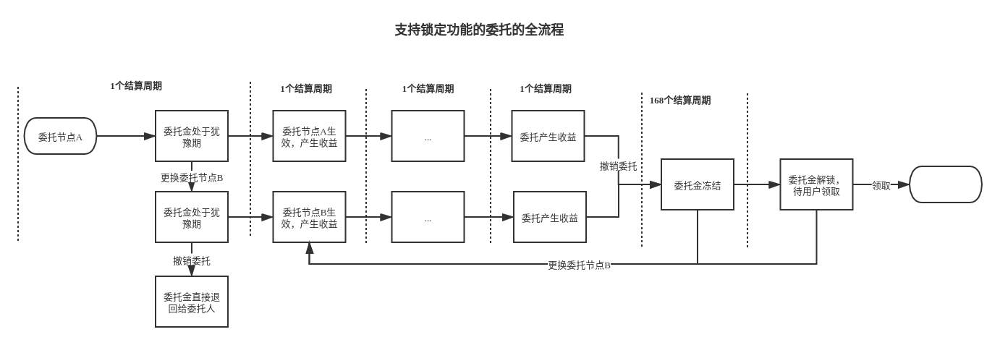

# PIP-6：关于支持委托锁定的提案

## 背景
PlatON网络上目前LAT持有者委托验证人节点是很灵活的，可以随时取消委托换其他人， 除了解委托的结算周期内（约3个小时）获取不到委托收益外不会有其他的损失， 这样会存在以下问题：

1. 公平性问题
对于节点来说，解除质押有锁定期，锁定期内限制流通，而委托没有限制的话对于质押节点来说是不太公平的，这样会影响质押节点的积极性，节点不愿意通过增加质押来获得收益而更愿意用来委托

2. 流通导致的安全问题
我们都知道对于PoS机制的公链来说Staking比例越高网络越安全，如果参与维护网络稳定的验证人节点都不愿意Staking，而把大部分Token用来委托，这样就极大增加了Token流通，给网络带来潜在的危险，举个简单的例子，恶意节点可以通过大量获得流动的Token，质押多个节点（超过2/3）来达到控制网络的目的

## 目的
限制用户随意解委托,撤销委托后委托金需要被锁定一段时间不能被任意使用。

## 内容

### 委托锁定流程
在现有委托的基础上增加锁定功能，流程如下：

支持锁定功能的委托有四个生命周期：

- 犹豫期

  用户发起委托时的结算周期为犹豫期。此时的委托金还没有生效,无法产生收益。

- 生效期

  犹豫期过后的结算周期为生效期，该周期内委托正式生效，委托金开始产生收益。

- 锁定期

  用户发起撤销委托操作后的56个结算周期,包含撤销委托操作位于的结算周期。此时的委托金被锁定住,不会产生委托收益,并且仅能用于重新委托节点,无法被用作其他用途。

- 解锁期

  锁定期过后的结算周期为解锁期,此时的委托金处于解锁状态,需要用户主动领取后返回到用户的余额或者锁仓账户中。

### 主要接口说明
#### 委托  
可以用三种资金来进行委托,分别是余额,锁仓账户,处于锁定期的委托金。使用处于锁定期的委托金进行委托时,优先采用解锁周期更长的委托金。解锁周期相同， 优先使用锁仓部分。

#### 撤销委托  
用户可以在委托金处于犹豫期和生效期发起撤销委托,委托金被撤销的优先级,从左到右由高到底:
  - 犹豫期->生效期
  - 余额->锁仓账户->锁定期的委托金

1. 被撤销的委托金在当前结算周期无法获得收益,之前的委托奖励会发放到用户余额中。
2. 犹豫期的委托金被撤销后,来自余额或者锁仓账户的部分,原路返还。来自锁定期的委托金的部分,会在包括当前结算周期在内一共锁定56个结算周期。
3. 生效期的委托被撤销后,会进入到锁定期,包括当前结算周期在内一共锁定56个结算周期。

#### 领取解锁的委托金  
1006,领取所有处于解锁期的委托金,会根据来源返还到用户的余额或者锁仓账户中。

#### 查询用户锁定与解锁期的委托金
1106,查询用户所有处于锁定期与解锁期的委托金的详细信息。

### 委托锁定周期
增加可治理参数,委托锁定周期,默认为56个结算周期。

